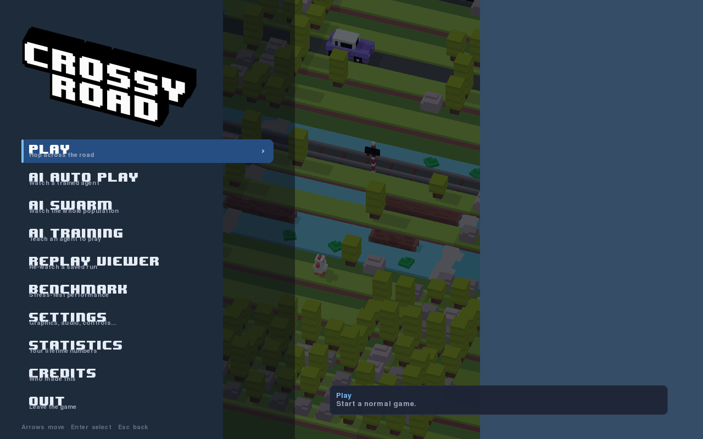
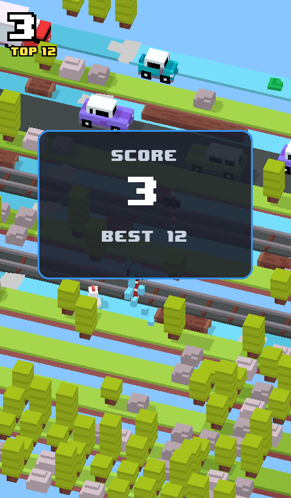
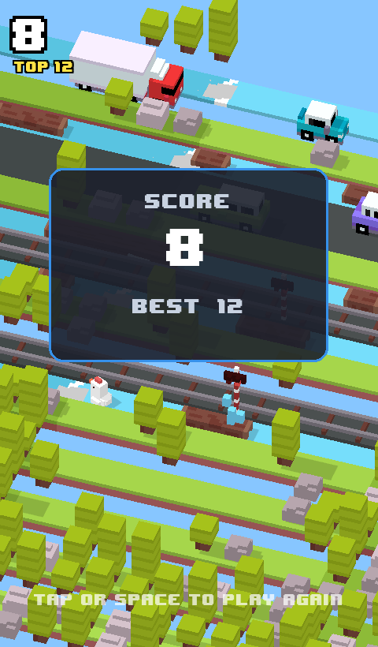
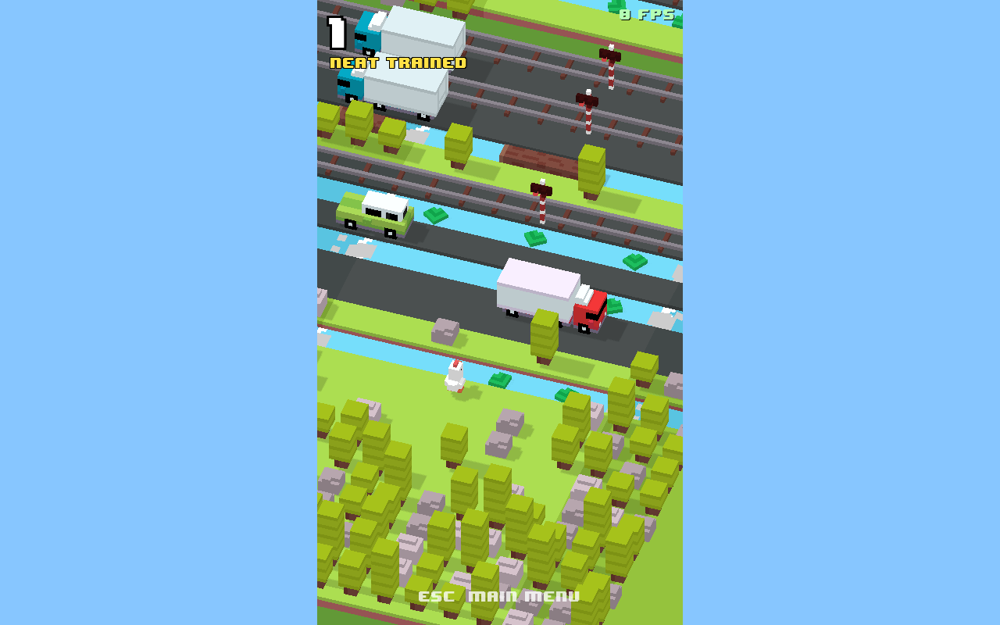
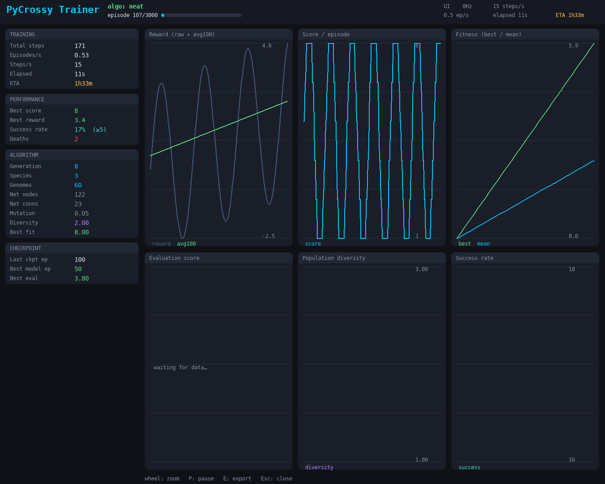
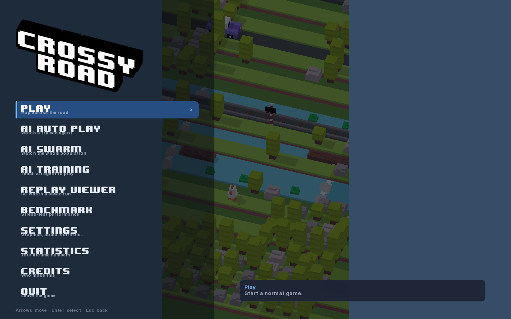
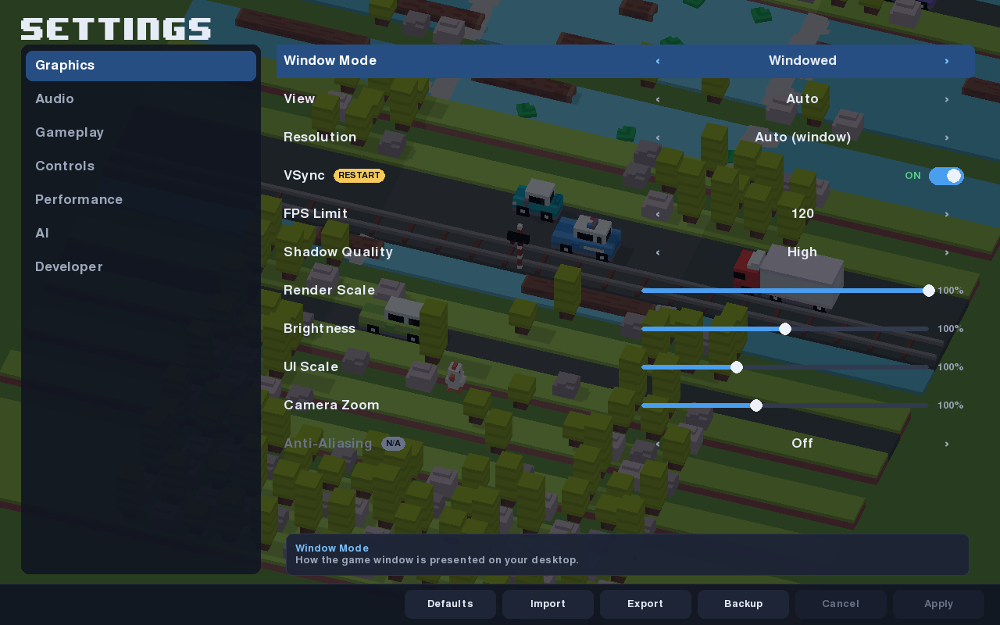
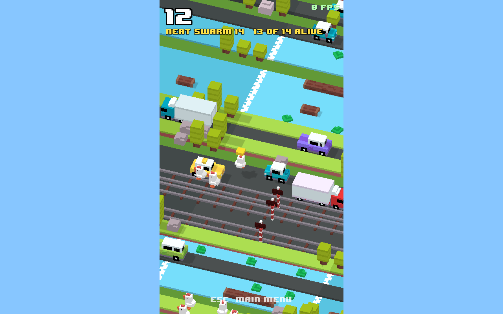

# PyCrossy

A GPU-accelerated **endless arcade hopper** built in Python — guide a low-poly chicken across
an infinite run of roads, rivers, railroads and log-strewn water, dodging traffic and trains
for as long as you can. It ships with a **modular reinforcement-learning framework**
(NEAT/PPO/A2C/DQN/ES/GA/CMA-ES) that learns to play it, a live two-window training mode and a
professional analytics dashboard.

| Home                   | Playing                | Game over                       |
| ---------------------- | ---------------------- | ------------------------------- |
|  |  |  |

| AI playing (window 1)   | Live dashboard (window 2)        |
| ----------------------- | -------------------------------- |
|  |  |

| Main menu (desktop)             | Settings (desktop)                      | AI Swarm                  |
| ------------------------------- | --------------------------------------- | ------------------------- |
|   |   |   |

---

## Features

- **Arcade gameplay** — hop timing, squash/stretch, camera follow-and-settle, grass/road/
  water/railroad lanes, lily-pad & log riding, trains with blinking warning lights, and
  guaranteed winnable paths (mechanics spec in [DESIGN.md](DESIGN.md)).
- **Real GPU rendering** — moderngl renderer of the actual voxel models with directional
  shadow mapping, sRGB Lambert shading and nearest-filtered textures, **GPU-instanced** to
  run well above 120 FPS.
- **Dedicated-GPU aware** — auto-detects and requests the high-performance GPU (NVIDIA
  PRIME offload / EGL device selection), logs the device at startup, falls back gracefully.
- **Fully responsive** — resolution-independent UI and four display modes: **Native** fills the
  whole window (the camera widens horizontally to match, so wide/desktop screens reveal more
  scenery instead of black bars), **Mobile**/**Stretch** letterbox a fixed phone aspect, and
  **Dynamic** auto-picks — across windowed / borderless / fullscreen, switchable at runtime,
  any aspect ratio (16:9 … 32:9, 4:3, portrait).
- **Full front-end** — a polished main menu with an adaptive **Desktop** (full-window, tabbed)
  and **Phone** (portrait) layout, a tabbed **Settings** system (Graphics / Audio / Gameplay /
  Controls / Performance / AI / Developer) with live-applied, persisted, corruption-safe
  config (Apply / Cancel / Defaults / Import / Export / Backup), rebindable keys, statistics
  and credits — navigable by keyboard, mouse or controller.
- **Launch modes from the menu** — Normal Play, AI Auto-Play & Replay Viewer (in-process),
  **AI Swarm** (watch the whole population run at once, camera on the leader), AI Training
  (spawns the dual-window trainer), a Benchmark, and a self-running demo backdrop.
- **Modular RL framework** — 7 interchangeable algorithms behind one interface, pure-numpy
  (no PyTorch required), selectable by name.
- **Live training mode** — two windows: the AI playing + a real-time multi-panel dashboard.
- **Production training pipeline** — parallel evaluation, checkpoint/resume, best-model
  autosave, TensorBoard/CSV/JSON metrics, deterministic replay recording, evaluation episodes.

## Requirements

- Python **3.11+** (developed on 3.14)
- An OpenGL **3.3+** GPU/driver (integrated, dedicated, or software fallback)
- Linux/macOS/Windows. Hybrid-GPU laptops are auto-handled on Linux (PRIME offload).

All Python dependencies are in [`requirements.txt`](requirements.txt): `pygame-ce`, `numpy`,
`moderngl`, `Pillow` (core); `matplotlib`, `tensorboardX` (metrics, optional); `pytest` (tests).

## Quick start

```bash
python3 -m venv .venv
source .venv/bin/activate                 # fish: source .venv/bin/activate.fish
pip install -r requirements.txt

python main.py                            # play the game
python train.py --algo neat               # train an AI (two windows: game + dashboard)
pytest                                    # run the test suite (98 tests)
```

## Controls

**In game** (keys are rebindable in Settings ▸ Controls):

| Input                  | Action                                   |
| ---------------------- | ---------------------------------------- |
| `W`/`↑`/`Space` or tap | Hop forward                              |
| `S`/`↓`                | Hop back                                 |
| `A`/`←`, `D`/`→`       | Hop left / right                         |
| `P`                    | Pause / resume                           |
| `Esc`                  | Pause, then back to the main menu        |
| tap / `Space`          | Restart after a game over                |

**In menus:** arrow keys / `WASD` to move, `Enter`/`Space` to select, `Esc` to go back,
`Tab` (or `Q`/`E`) to switch settings tabs, `‹`/`›` or drag to adjust a control. Mouse and a
game controller (D-pad / A / B / bumpers) work throughout.

**Anywhere:** `F11` fullscreen · `F10` borderless · `F9` cycle view (auto → desktop → phone).

## Main menu & settings

Launching `python main.py` opens the **main menu** over a live, self-playing demo backdrop.
It adapts to the window: a **Desktop** front-end (full-window, left tab rail) on landscape
windows and a **Phone** front-end (portrait) on tall ones — force either in
**Settings ▸ Graphics ▸ View**. From the menu you can start a game, watch / replay / train an
AI, run an **AI Swarm** (many chickens at once — each on its own policy from the population,
with the camera following the leader; size in Settings ▸ AI), run a benchmark, or open
Settings / Statistics / Credits.

**Settings** are grouped into tabs and **applied live, validated, and saved** to
`~/.pycrossy/settings.json` (atomic write; a missing or corrupt file safely falls back to
defaults). Each pane has **Apply / Cancel**, plus **Defaults**, **Import**, **Export** and
**Backup**. Controls that need a window rebuild are marked `RESTART`; a few present-but-not-
yet-wired options (e.g. Anti-Aliasing) are honestly marked `N/A`.

| Tab             | Highlights                                                                       |
| --------------- | -------------------------------------------------------------------------------- |
| **Graphics**    | Window mode, View (desktop/phone/auto), resolution, VSync, FPS limit, shadow quality, render scale, brightness, UI scale, camera zoom |
| **Audio**       | Master / SFX / UI volume, mute                                                    |
| **Gameplay**    | Difficulty (scales traffic speed), camera smoothness, screen shake, auto-pause, hints |
| **Controls**    | Rebindable Up/Down/Left/Right/Pause, reset to defaults                            |
| **Performance** | Prefer high-performance GPU, show FPS, performance overlay, live GPU/renderer info |
| **AI**          | Algorithm, training/play speed, parallel envs, seed (feed the AI launch modes)    |
| **Developer**   | Debug mode, logging level (collision overlay reserved)                            |

## Configuration

`python main.py [--mode native|mobile|stretch|dynamic] [--width W] [--height H] [--no-audio] [--no-vsync]`

CLI flags are one-off overrides of the saved settings; with no flags the game uses your
saved configuration. Settings can also be exported/imported as JSON for sharing profiles.

Gameplay constants live in [`pycrossy/config.py`](pycrossy/config.py):
camera, lighting, animation timing, spawn parameters, window size, target FPS,
`PREFER_DEDICATED_GPU`, and `GPU_SYNC_BEFORE_SWAP` (forces GPU completion before each buffer
swap — keeps presentation flicker-free on hybrid-GPU laptops). Set the env var
`PYCROSSY_GPU=integrated` to force the integrated GPU. The training dashboard's graph
refresh rate is set with `--dashboard-hz` (default 12; 5–20 recommended).

The high score, selected character and lifetime statistics persist to `~/.pycrossy/save.json`; all settings to `~/.pycrossy/settings.json`.

## AI training guide

```bash
python train.py --list                         # neat, ppo, a2c, dqn, es, ga, cmaes
python train.py --algo neat --headless          # fast headless training (recommended)
python train.py --algo dqn  --headless          # gradient algos: ALWAYS prefer headless
python train.py --algo cmaes --headless --set sigma=0.6 --set pop_size=96   # tune hyperparams
python train.py --algo neat --headless --eval-episodes 4   # 4 shared seeds / candidate (CRN)
python train.py --algo neat --resume runs/neat  # resume from a checkpoint

# Evaluate a trained policy over many held-out seeds (mean/median/best/worst/std/success rate)
python -m ai.evaluate runs/neat/best_model.pkl --episodes 200
# Benchmark several algorithms under identical conditions (shared seeds, multi-seed CIs)
python -m ai.benchmark --algos neat,cmaes,ppo,dqn --seeds 0,1,2 --episodes 6000
python -m ai.benchmark --compare runs/neat runs/cmaes --episodes 200   # compare existing models
```

Key flags: `--algo`, `--episodes`, `--logdir`, `--seed`, `--headless`, `--no-dashboard`,
`--parallel N`, `--speed`, `--eval-every`, `--eval-episodes` (CRN seeds per candidate),
`--checkpoint-every`, `--resume`, `--no-tensorboard`, `--set KEY=VAL` (repeatable
hyperparameter override), `--config file.json`.

> **Training quality (see [`docs/AI_AUDIT.md`](docs/AI_AUDIT.md)).** Population algorithms are
> evaluated with **Common Random Numbers** — every candidate in a generation is scored on the
> *same* rotating bank of seeds, so selection compares *policies*, not map luck. The saved
> champion is chosen by **held-out validation** on a fixed disjoint seed bank, so `best_model.pkl`
> is a re-validated policy rather than the single luckiest episode. Gradient algos (DQN/PPO/A2C)
> must run `--headless`: the live render loop paces the sim to real time and starves training.

**Parallel evaluation** (`--parallel N`, also Settings ▸ AI ▸ Parallel Environments) applies to
the **population** algorithms (NEAT / ES / GA / CMA-ES). It works in **both** modes: headless
evaluates whole generations across N worker processes; **live** evaluates each generation across
N workers in the background while the window showcases the current best genome (the HUD shows
`xN workers`). PPO / A2C / DQN aren't population-based, so `--parallel` is a no-op for them.

**State** (`OBS_SIZE = 138`): player x / motion / riding flags, riding-drift velocity,
distance-to-edge, score & time, camera offset, and for the next 10 lanes — type one-hot,
**arrival-time** column safety (hazards are projected forward over the hop so the agent reasons
about whether a gap will still be there when it lands), nearest-hazard distance/velocity left
& right, and the railroad warning-light state. **Actions**: `UP, DOWN, LEFT, RIGHT, WAIT`.
**Reward**: `+1` per new (furthest) row minus a `-0.01`/step time cost (so progress strictly
beats loitering), with penalties for death (`-1`), backward (`-0.3`) and bumping. (See
[`ai/observation.py`](ai/observation.py), [`ai/env.py`](ai/env.py).)

| Algorithm     | Family             | Notes                                                       |
| ------------- | ------------------ | ----------------------------------------------------------- |
| `neat`        | Neuroevolution     | Full NEAT (innovations, **adaptive-threshold** speciation, crossover) |
| `ppo` / `a2c` | Policy gradient    | Shared numpy actor-critic + GAE (corrected entropy bonus)   |
| `dqn`         | Value-based        | Double DQN + replay + target net + Huber/clipped TD         |
| `ddqn`        | Value-based        | **Production Double DQN** — dueling + prioritized replay + n-step + obs-norm (modular) |
| `minimax`     | Planning (search)  | **Expectimax** forward-model planner — no training, plans live; *strongest agent* |
| `es`          | Evolution strategy | OpenAI-style rank gradient with **mirrored** sampling       |
| `ga`          | Genetic algorithm  | Elitism + tournament + uniform crossover                    |
| `cmaes`       | CMA-ES             | Separable (diagonal); validates the distribution **centre** |

See [`docs/AI_NEW_AGENTS.md`](docs/AI_NEW_AGENTS.md) for the Minimax planner and DDQN designs,
heuristics, configuration flags, and benchmark results.

Each run writes to `runs/<algo>/`: `metrics.csv`, `summary.json`, TensorBoard events
(`tensorboard --logdir runs`), `checkpoint.pkl` (resume), `best_model.pkl` (saved on **validated**
eval improvement), `best_history.jsonl` (every champion improvement) and `best_replay.json`
(a deterministic replay of the best episode); `runs/index.json` is a cross-run model registry.

Add a new algorithm by dropping a `@register("name")` `Algorithm` subclass into
`ai/algorithms/` — no game or trainer changes needed.

## Dashboard overview

The live dashboard (second window) is a dark-themed ML experiment view that updates
continuously: a header with an episode **progress bar** + FPS / episodes-per-sec /
steps-per-sec / elapsed / ETA; a grouped **stats column** (Training / Performance /
Algorithm / Checkpoint); and a **3×2 graph grid** — reward (raw + moving average), score
timeline, loss curves *or* best/mean fitness, evaluation score, population diversity, and
success rate. Mouse-wheel **zooms** the time window, `E` **exports** high-res matplotlib
plots + a screenshot to `runs/<algo>/plots/`, `P` pauses, `Esc` closes.

## Development setup

```bash
pip install -r requirements.txt
pip install pyflakes pytest          # dev tools
python -m pyflakes pycrossy ai       # lint
pytest                               # tests
```

See [docs/ARCHITECTURE.md](docs/ARCHITECTURE.md) for the system map and how the pieces fit.

## Testing

```bash
pytest                               # 98 tests
SDL_VIDEODRIVER=dummy SDL_AUDIODRIVER=dummy pytest   # fully headless (CI)
```

Covers movement, collision, scoring, spawn logic, the AI environment, replay determinism,
per-algorithm save/load, trainer checkpoint/resume, network gradients (finite-difference
checked), responsive layout, and GPU classification.

## Troubleshooting

- **Stuck on the integrated GPU** — the startup banner reports the active GPU. On Linux
  hybrid laptops, launch with `__NV_PRIME_RENDER_OFFLOAD=1 __GLX_VENDOR_LIBRARY_NAME=nvidia
  SDL_VIDEODRIVER=x11 python main.py`, or configure PRIME offload in your system settings.
- **No window / OpenGL error** — ensure an OpenGL 3.3+ driver is installed; on headless
  servers the renderer still works via EGL but `main.py` needs a display.
- **No audio** — `pygame.mixer` may be unavailable; the game runs silently (use `--no-audio`).
- **No TensorBoard** — `tensorboardX` is optional; CSV/JSON metrics are always written.
- **Two windows don't both appear (Wayland)** — the trainer spawns the dashboard as a
  separate process; if your compositor blocks it, training continues (use `--no-dashboard`).
- **Flicker / black frames on a hybrid-GPU laptop** — handled by `GPU_SYNC_BEFORE_SWAP`
  (on by default), which forces GPU completion before the cross-GPU presentation copy. If
  you ever need to disable it (e.g. on a single-GPU desktop for max throughput), set it to
  `False` in `config.py`. The dashboard is double-buffered and redraws on a throttle, so
  both windows stay flicker-free and responsive independently during long sessions.
- **Wayland / Hyprland / Sway** — fully supported and the *recommended* path: the windows
  render with SDL's **native Wayland backend** (not XWayland), which avoids the texture
  flicker, black frames and window thrashing that XWayland + NVIDIA causes on tiling
  compositors. The dedicated GPU is still used via PRIME offload under Wayland. To force a
  specific backend, set `SDL_VIDEODRIVER=wayland` (or `x11`) before launching.

## Performance recommendations

- Use the dedicated GPU (default) for both play and the live AI window.
- For fastest training use `--headless` (no rendering) and `--parallel <cores>` for the
  evolutionary algorithms (NEAT/ES/GA/CMA-ES).
- Logic runs at a fixed 60 Hz for deterministic per-frame motion while rendering targets
  120 FPS; lower `TARGET_FPS` in `config.py` to cap GPU usage.

## Known limitations

- Only the chicken character is enabled by default; other rigs ship on disk and are
  auto-detected if present.
- In-process parallelism is via subprocess workers (the game uses a process-global tween
  manager), so a single process runs one active env at a time.
- The numpy deep-RL implementations (PPO/A2C/DQN) prioritise dependency-free clarity over
  raw speed; the evolutionary methods are the fastest path to a strong agent here.

## Future improvements

- Optional PyTorch backend for the gradient algorithms.
- Frame-stack / pixel observations and a CNN policy option.
- Additional characters and a character-select screen.
- Curriculum / reward-shaping presets per algorithm.

## Contributing

Issues and PRs welcome. Please keep the gameplay feel consistent (see `DESIGN.md`),
run `pytest` and `pyflakes` before submitting, and match the existing style (type hints,
small focused modules, docstrings explaining *why*).

## License & attribution

The Python code in `pycrossy/` and `ai/` is provided for educational/research use.

The bundled game art, textures, audio and font in [`assets/`](assets/) were **not** created for
this project — they are reused from a third-party project (© Evan Bacon and contributors) under
the MIT License. Full attribution, the reused-asset inventory, and the MIT licence text are in
[`assets/ATTRIBUTION.md`](assets/ATTRIBUTION.md).
